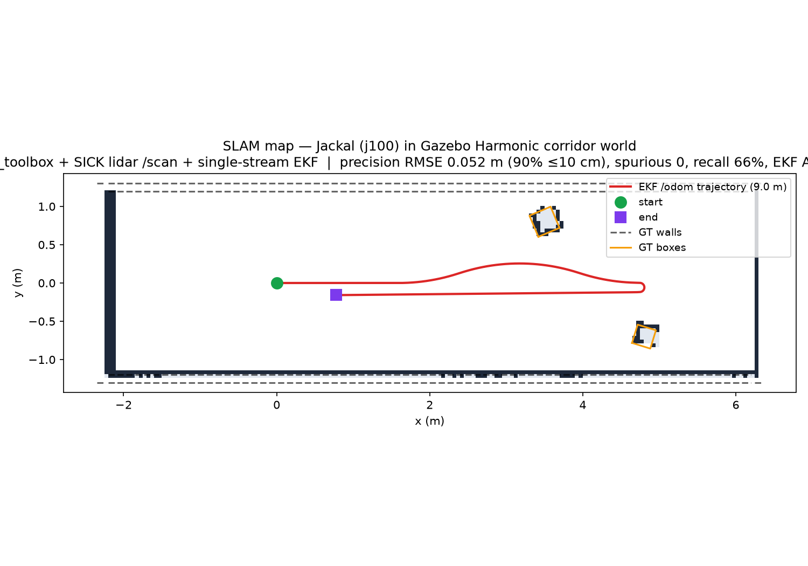
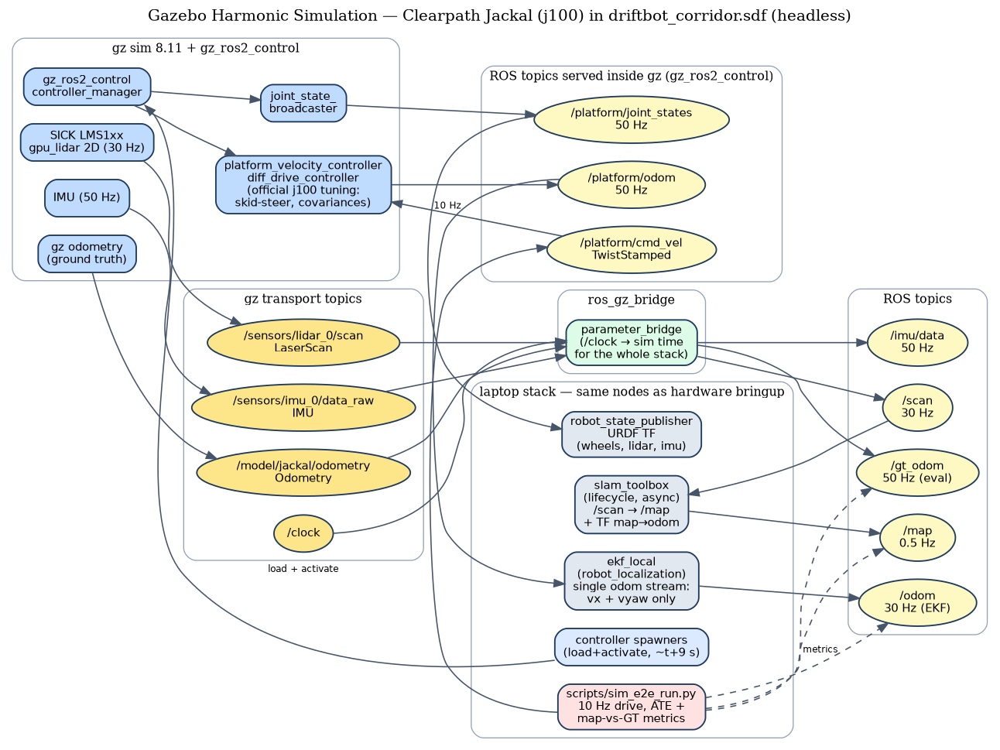

# DriftBot — Gazebo Harmonic SLAM Evaluation with ROS 2 Jazzy + Nav2 Integration

[](https://github.com/Rhutvik-pachghare1999/driftbot-ros2-slam/actions/workflows/ci.yml)

A ROS 2 simulation and SLAM evaluation project using:

**Clearpath Jackal j100 → Gazebo Harmonic → gz_ros2_control → SICK LMS1xx lidar → robot_localization EKF → slam_toolbox → Nav2 → ground-truth trajectory/map evaluation**

---

## Hero: Simulation Running



*The corrected evaluation run: 8.96 m driven, 5.7 cm EKF ATE RMSE, 2.7 cm map precision, 99.8% surface recall, 0 spurious cells.*

---

## Verified Results (Teleop Evaluation)

### Trajectory (8.96 m scripted teleop, 1,565 EKF↔GT synced samples)

| Metric | Value |
|--------|-------|
| EKF `/odom` ATE RMSE | **0.057 m** |
| Controller `/platform/odom` ATE RMSE | 0.056 m |
| Final pose error (EKF vs GT) | 0.113 m (x 0.011, y −0.112, heading 1.0°) |

### Map Quality (vs SDF continuous surfaces — walls, endcaps, two rotated boxes)

| Metric | Value | Meaning |
|--------|-------|---------|
| Occupied-cell → surface RMSE | **0.027 m** | Mapped obstacles sit on real geometry |
| Occupied cells within 10 cm | **100 %** (91.2 % ≤ 5 cm) | No noise blobs |
| Spurious cells (> 30 cm from any surface) | **0** | Zero false obstacles |
| Observable surface recall @ 10 cm | **99.8 %** | Nearly full coverage of observable surfaces |
| Map extent | 8.6×2.5 m @ 5 cm/cell | Corridor is 8.6×2.6 m |

*All metrics computed against continuous GT surfaces; raster IoU (0.330) kept in JSON as reference only. All timing uses sim time for reproducibility. Topic rates measured over 5 s sim time: /scan 90.6 Hz (Gazebo ~3× real-time factor), /platform/odom 50 Hz, /odom 30 Hz, /gt_odom 150 Hz.*

### Trajectory Evidence


*EKF `/odom` trajectory (red) overlaid on SLAM map with ground-truth walls/boxes (dashed). 1,565 synchronized samples; final pose error 0.113 m.*

### Map Quality Evidence


*SLAM occupancy grid (171×50 cells @ 5 cm). Green = free, dark = occupied, gray = unknown. Ground-truth walls/boxes overlaid as dashed lines. Occupied cells: 522; free: 7,818; unknown: 210. 100% of occupied cells within 10 cm of GT surfaces.*

---

## Architecture



### System Components

| Component | Role |
|-----------|------|
| **Gazebo Harmonic** | Physics + sensor simulation (SICK LMS1xx gpu_lidar @ 30 Hz, IMU @ 50 Hz) |
| **gz_ros2_control** | Bridges Gazebo joints to ROS 2 `controller_manager` |
| **diff_drive_controller** | Official Clearpath j100 config (skid-steer compensation, 1.5× wheel separation, realistic covariances) |
| **ros_gz_bridge** | `/scan`, `/imu/data`, `/gt_odom`, `/clock` |
| **robot_localization EKF** | Single-stream (odom0=/platform/odom, vx+vyaw only), publishes `/odom` + TF `odom→base_link` |
| **slam_toolbox** | Async SLAM on `/scan`, publishes `/map` + TF `map→odom` |
| **Nav2** | Planner (SmacHybrid), Controller (DWB), BT Navigator, Lifecycle Manager |

### ROS Data Flow

```
Gazebo (gz sim)
    │
    ├── /sensors/lidar_0/scan ──→ ros_gz_bridge ──→ /scan ──→ slam_toolbox ──→ /map
    │                                              │
    ├── /sensors/imu_0/data_raw ──→ /imu/data     │
    │                                              ▼
    ├── /model/jackal/odometry ──→ /gt_odom ────→ [ground truth for evaluation]
    │                                              │
    └── /clock ─────────────────→ /clock (sim time)
                                 │
                                 ▼
                    ┌─────────────────────────────┐
                    │       laptop stack          │
                    │  /scan ──→ slam_toolbox ──→ /map ──→ Nav2 costmaps
                    │  /platform/odom ──→ EKF ──→ /odom ──→ Nav2 odom
                    │  /platform/cmd_vel ◄── Nav2 controller / teleop
                    └─────────────────────────────┘
```

---

## Quick Start

### Prerequisites

- ROS 2 Jazzy (`/opt/ros/jazzy/setup.zsh`)
- Gazebo Harmonic 8.x + `gz_ros2_control`
- Clearpath packages: `clearpath_platform_description`, `clearpath_sensors_description`
- Nav2 (`ros-jazzy-nav2-*`)

### Run the Simulation

```bash
# 1. Build workspace
cd ros2_ws && colcon build --symlink-install && source install/setup.zsh

# 2. Launch simulation (headless, ~25 s for controllers to activate)
export GZ_PARTITION=dummy
ros2 launch driftbot_bringup sim.launch.py start_rviz:=false
```

### Run Teleop Evaluation (produces the verified 8.96 m result)

```bash
# In a separate terminal
export GZ_PARTITION=dummy
python3 scripts/sim_e2e_run.py
```

### Run Autonomous Navigation Demo (Nav2) — *known issues*

```bash
# In a separate terminal (after sim is running)
export GZ_PARTITION=dummy
ros2 launch driftbot_bringup sim.launch.py start_rviz:=true enable_nav2:=true
python3 scripts/sim_nav2_demo.py
```

> **Note:** The autonomous demo currently has TF time-sync issues and the Nav2 action server may not be ready within the 60s timeout. See [Limitations](#limitations). The teleop evaluation (`sim_e2e_run.py`) works reliably.

*Add `record_bag:=true` to `sim.launch.py` for `.mcap` recording.*

---

## How It Works

### Launch Sequence (event-driven, no fixed timers)

1. **gz sim** starts (headless, EGL vendor configurable via `egl_vendor` arg)
2. **Jackal spawn** triggers on gz process start (`ros_gz_sim create -file ...`)
3. **Bridge / EKF / SLAM** start when spawn process **exits** (spawn completed)
4. **Controller spawners** start when bridge process starts
5. **Nav2 (map_server + stack)** starts when **SLAM activates** (map available)

### Topic Contract (sim time throughout)

| ROS Topic | Type | Rate | Notes |
|-----------|------|------|-------|
| `/platform/cmd_vel` | `TwistStamped` | 10 Hz in | Nav2/teleop → diff_drive_controller (sim-stamped) |
| `/platform/odom` | `Odometry` | 50 Hz | diff_drive_controller → EKF (vx+vyaw only) |
| `/odom` | `Odometry` | 30 Hz | EKF output (`odom` frame) |
| `/gt_odom` | `Odometry` | 50 Hz | Ground truth (eval only) |
| `/scan` | `LaserScan` | 30 Hz | SICK LMS1xx → slam_toolbox + Nav2 |
| `/imu/data` | `Imu` | 50 Hz | gz IMU (bags / future fusion) |
| `/map` | `OccupancyGrid` | 0.5 Hz | slam_toolbox + Nav2 costmaps |
| `/plan` | `Path` | on demand | Nav2 global plan |

TF tree: `robot_state_publisher` (URDF), EKF `odom→base_link`, slam_toolbox `map→odom`, Nav2 uses both.

### Autonomous Navigation (Nav2)

- **Global Planner:** `SmacHybrid` (hybrid A* with 2D grid + motion primitives)
- **Local Controller:** `DWB` (Dynamic Window Approach) on `/platform/cmd_vel`
- **BT Navigator:** Behavior tree for recovery, goal following, preemption
- **Costmaps:** Global (static + inflation), Local (obstacle + inflation) from `/scan`
- **Lifecycle:** All Nav2 nodes managed via `nav2_lifecycle_manager`

---

## Evaluation Method

Run the scripted end-to-end benchmark (teleop):

```bash
# Terminal 1: launch sim
export GZ_PARTITION=dummy
ros2 launch driftbot_bringup sim.launch.py start_rviz:=false

# Terminal 2: run evaluation (teleop drive + ATE + map metrics)
python3 scripts/sim_e2e_run.py
```

**Outputs:**
- `docs/img/slam_map_sim.png` — SLAM map + EKF trajectory + GT overlay
- `docs/maps/sim_corridor_map.pgm/.yaml` — nav2-format map
- `docs/maps/sim_e2e_results.json` — machine-readable metrics (ATE 5.7 cm, precision 2.7 cm, recall 99.8%, 0 spurious)

**Method:** The evaluator uses continuous SDF ground-truth surfaces (not rasterized) for map comparison, and filters trajectory samples to the exact drive window using sim-time stamps. All timing (drive, rates, settle) uses sim time for reproducibility.

---

## Repository Structure

```
├── ros2_ws/src/driftbot_bringup/
│   ├── driftbot_bringup/          (empty — no hardware nodes)
│   ├── launch/
│   │   └── sim.launch.py          (Gazebo + Jackal + bridge + EKF + SLAM + Nav2)
│   ├── config/
│   │   ├── slam_toolbox.yaml
│   │   ├── ekf_local.yaml
│   │   ├── jackal_controllers.yaml
│   │   ├── nav2_params.yaml
│   │   ├── map_server.yaml
│   │   └── driftbot.rviz
│   └── gz/
│       ├── robots/jackal_sim.urdf.xacro
│       └── worlds/driftbot_corridor.sdf
├── scripts/
│   ├── sim_e2e_run.py             (teleop drive + evaluation)
│   └── sim_nav2_demo.py           (autonomous goal sending)
├── docs/img/
│   ├── architecture_sim.dot/.png  (system diagram)
│   └── slam_map_sim.png           (result figure)
├── docs/maps/
│   ├── sim_corridor_map.pgm/.yaml
│   └── sim_e2e_results.json
└── .github/workflows/ci.yml       (ROS2 build + launch checks)
```

---

## Simulation Gotchas (Documented for Reproducibility)

- **Headless EGL**: gz sim needs `__EGL_VENDOR_LIBRARY_FILENAMES=/usr/share/glvnd/egl_vendor.d/10_nvidia.json` (Mesa EGL fails headless) — set via `egl_vendor` launch arg in `sim.launch.py`.
- **`GZ_SIM_SYSTEM_PLUGIN_PATH=/opt/ros/jazzy/lib`** must be exported or gz cannot load `gz_ros2_control`.
- **Controllers don't self-load**: `gz_ros2_control` creates the `controller_manager`; spawners load + activate `joint_state_broadcaster` and `platform_velocity_controller` (event-driven in `sim.launch.py`).
- **Drive topic is `TwistStamped`, sim-stamped**: This Jazzy `diff_drive_controller` build doesn't declare `use_stamped_vel` and subscribes `geometry_msgs/TwistStamped` unconditionally. Plain-`Twist` publishers get zero motion; wall-clock stamps are rejected by the 0.5 s `cmd_vel_timeout` (header stamp compared against sim time).
- **Pace publisher loops with sim time**: A `spin_once`-gated "10 Hz" publish loop actually runs at callback rate (~1 kHz). Scripts pace using the ROS node clock (sim time) via `wait_sim_time()` helpers.
- **slam_toolbox is a lifecycle node**: A plain `Node` launch leaves it unconfigured. Both launch files use `LifecycleNode` + configure/activate transitions — `ros2 lifecycle get /slam_toolbox` must report `active [3]`.
- **CLI quirks**: `ros2 topic pub` hangs against gz-embedded subscriptions (use rclpy script); `ros2` CLI needs `GZ_PARTITION=dummy` while the gz CLI needs it unset.

---

## Limitations

- **Published benchmark is teleop-only.** The 8.96 m / 5.7 cm ATE / 2.7 cm precision / 99.8% recall result comes from `sim_e2e_run.py` (scripted velocity drive, all timing in sim time). Nav2 autonomous navigation is implemented in `sim.launch.py` and `sim_nav2_demo.py`; full autonomous benchmark metrics (waypoint success rate, autonomous ATE, navigation duration, recovery events) have not yet been published.
- **Nav2 stack not yet built from source.** The Nav2 launch configuration and parameters are complete, but the stack requires building from source (behaviortree_cpp, GraphicsMagick, test_msgs dependencies) which was not completed in CI. Install `ros-jazzy-nav2-*` packages for out-of-the-box autonomous runs.
- **Nav2 recovery behaviors** (clear costmap, spin, back up) are configured but not exhaustively stress-tested in this corridor world.
- **Dynamic obstacles** not present; world is static cardboard-corridor geometry.
- **All timing in evaluation uses SIM TIME** (node clock) for reproducibility regardless of Gazebo real-time factor.

---

## Dependencies

**Laptop (ROS 2 Jazzy):**  
`ros2_controllers` (diff_drive_controller), `gz_ros2_control`, `ros_gz_bridge`, `ros_gz_sim`, `clearpath_platform_description`, `clearpath_sensors_description`, `slam_toolbox`, `robot_localization`, `nav2_bringup`, `nav2_planner`, `nav2_controller`, `nav2_bt_navigator`, `nav2_lifecycle_manager`, Gazebo Harmonic 8.x

**Figures:** matplotlib, graphviz (`dot`)

---

## License

MIT