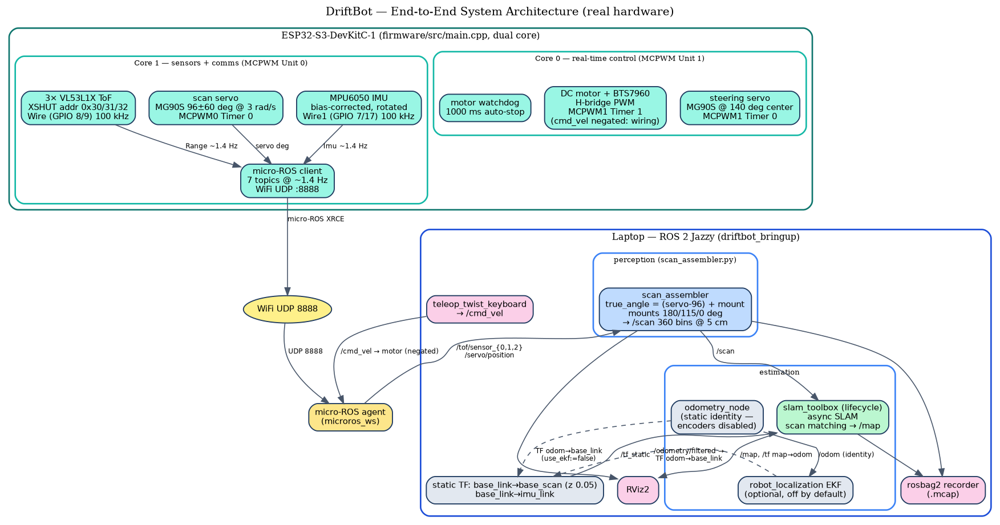
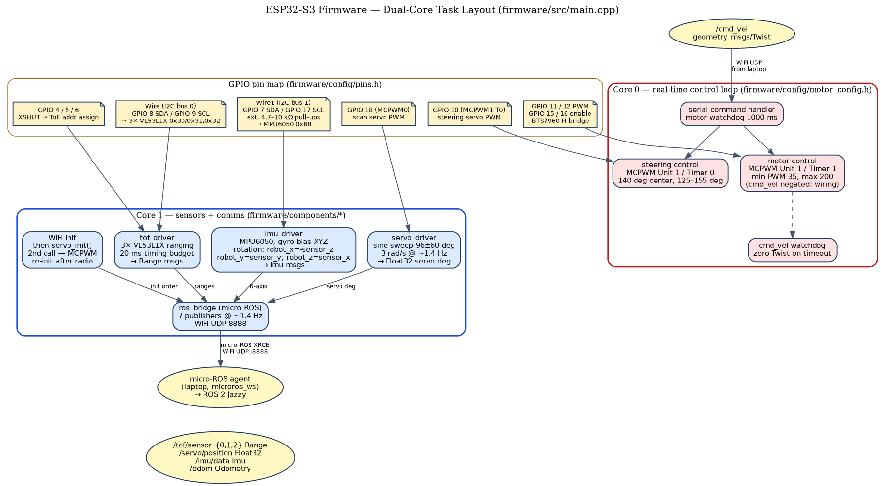
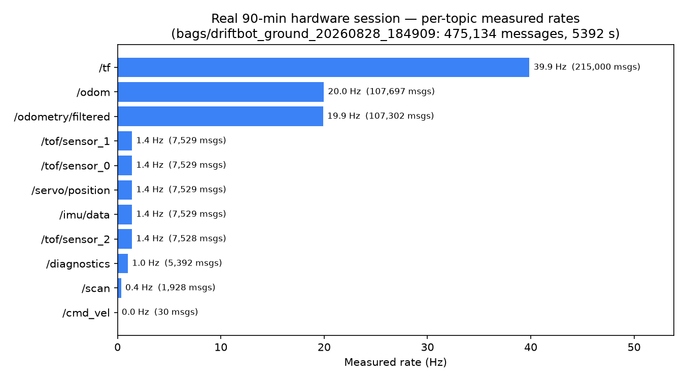
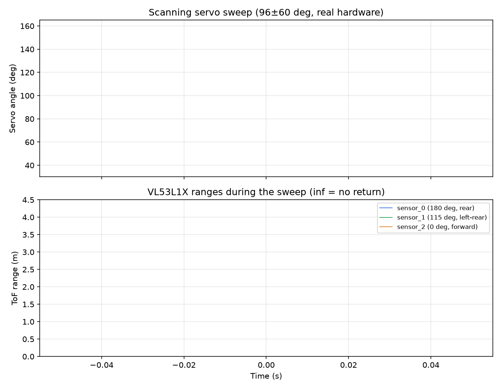
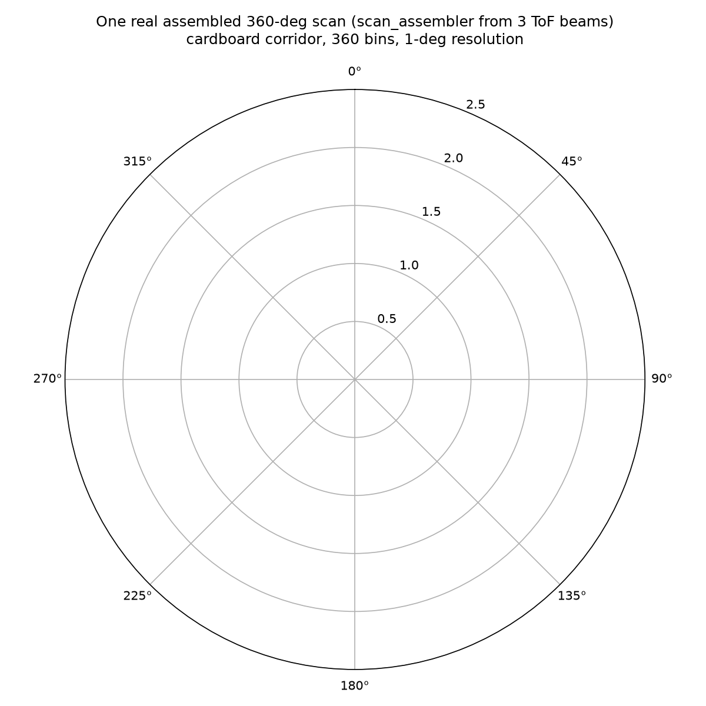
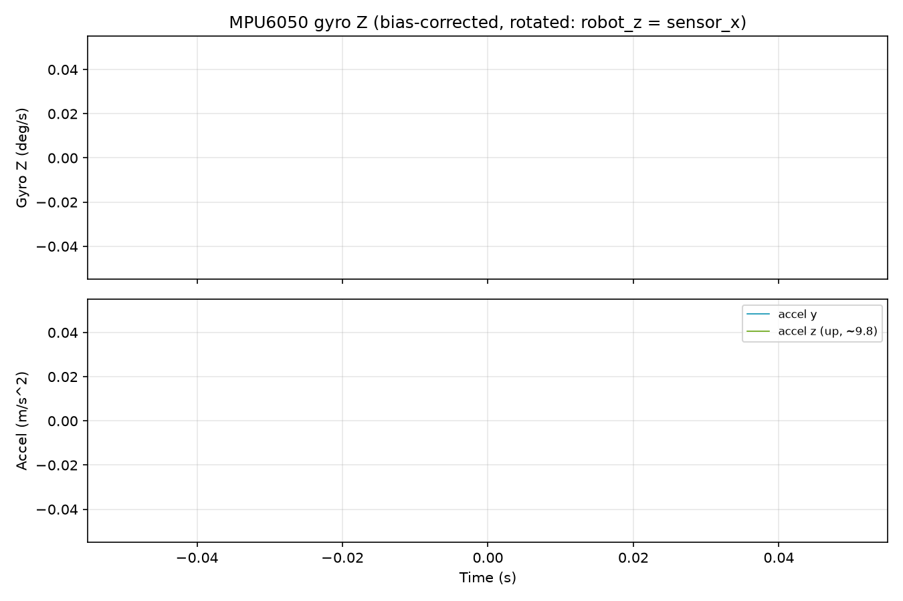

# DriftBot — Ground Robot with 360° Scanning-ToF SLAM (ROS2)

[](https://github.com/Rhutvik-pachghare1999/driftbot-ros2-slam/actions/workflows/ci.yml)

A from-scratch ground robot featuring a custom rotating ToF sensor array for 360° environment mapping. ESP32-S3 firmware communicates with a ROS2 Jazzy laptop over micro-ROS WiFi UDP for real-time SLAM — and the same laptop SLAM/EKF stack runs **verified end-to-end in Gazebo Harmonic** on a Clearpath Jackal (j100) sim agent with quantitative ground-truth scoring.

**Built to demonstrate:** full-stack robotics — embedded firmware, sensor integration with optional EKF, state estimation, real-time control, ROS2 integration, and simulation.

**Evidence at a glance:** CI runs on every push (firmware host tests + ESP32-S3 build + ROS2 colcon build + launch/config checks) · 12/12 firmware unit tests pass (`pio test -e native`) · ESP32-S3 firmware builds clean · 90-min hardware bag (475k msgs) · **verified end-to-end sim run — 8.97 m driven, EKF ATE 6.4 cm, SLAM map 8.5×2.5 m with 3.1 cm obstacle precision and zero spurious cells (`docs/maps/sim_e2e_results.json`)** · every figure in this README comes from a recorded session.

---

## 1. System Architecture



*ESP32-S3 (Core 0 = real-time motor/steering, Core 1 = sensors + micro-ROS) → WiFi UDP → laptop stack (scan_assembler → slam_toolbox, optional EKF, RViz, rosbag2).*



*Two I2C buses (`Wire` = 3× VL53L1X ToF, `Wire1` = MPU6050 IMU), MCPWM Unit 1 for drive, Unit 0 for the scanning servo, micro-ROS client publishing 7 topics at ~1.4 Hz.*

## 2. Real Measured Data (90-minute hardware session)

All plots below are generated **from the recorded `.mcap` bag** (`bags/driftbot_ground_20260828_184909`, 475,134 messages, 5392 s on the physical robot) by `scripts/make_figures.py` — not mock-ups.

### 2.1 Pipeline throughput (per-topic measured rates)



| Topic | Type | Messages | Measured rate |
|-------|------|---------:|--------------:|
| `/tf` | `tf2_msgs/TFMessage` | 215,000 | ~39.9 Hz |
| `/odom` | `nav_msgs/Odometry` | 107,697 | ~20.0 Hz |
| `/odometry/filtered` | `nav_msgs/Odometry` (EKF) | 107,302 | ~19.9 Hz |
| `/imu/data` | `sensor_msgs/Imu` | 7,529 | ~1.4 Hz |
| `/servo/position` | `std_msgs/Float32` | 7,529 | ~1.4 Hz |
| `/tof/sensor_{0,1,2}` | `sensor_msgs/Range` | 7,529 each | ~1.4 Hz each |
| `/scan` | `sensor_msgs/LaserScan` | 1,928 | ~0.36 Hz |
| `/cmd_vel` | `geometry_msgs/Twist` | 30 | on demand |

### 2.2 Scanning servo + ToF ranges (live sweep)



The three VL53L1X beams (mount angles 180°/115°/0°) sweep with the servo; `inf` readings are out-of-range (no return within 4 m).

### 2.3 One real assembled 360° scan



`scan_assembler` fuses the 3 beams + servo angle into a 360-bin `sensor_msgs/LaserScan` — this is what `slam_toolbox` consumes.

### 2.4 IMU (bias-corrected, rotated to robot frame)



Firmware subtracts the calibrated gyro bias (Z = +0.0086 rad/s) and applies the rotation matrix (`robot_x = -sensor_z`, etc.) before publishing.

### 2.5 Session evidence figure


## 3. Simulation (Gazebo Harmonic) — Verified End-to-End

The laptop stack runs unmodified in Gazebo Harmonic on a **Clearpath Jackal (j100)** sim agent: `gz_ros2_control` drives a `diff_drive_controller` with Clearpath's official j100 tuning (wheel geometry, 1.5× skid-steer compensation, realistic twist covariances), a SICK LMS1xx 2D lidar, and an IMU. The same `slam_toolbox` (lifecycle-managed) and `robot_localization` EKF that consume the real robot's data consume the sim's — plus ground-truth odometry for scoring.


### 3.1 Run it

```bash
# headless (EGL vendor lib set automatically); controllers activate ~25 s in
ros2 launch driftbot_bringup sim.launch.py start_rviz:=false

# scripted end-to-end demo: drives a 9-segment coverage path (8.97 m) via
# /platform/cmd_vel (TwistStamped, 10 Hz), measures live topic rates,
# records all three odometry streams, captures the SLAM map, and scores
# trajectory + map against ground truth (ATE, precision, recall)
python3 scripts/sim_e2e_run.py
```

Add `record_bag:=true` for an `.mcap` recording. Drive commands are `geometry_msgs/TwistStamped` **stamped in sim time** — this Jazzy `diff_drive_controller` build subscribes `TwistStamped` unconditionally and halts the robot 0.5 s after the last command (`cmd_vel_timeout`); plain-`Twist` publishers get zero motion (see gotchas below).

### 3.2 Verified sim topology (all measured live)

| ROS topic | Type | Rate | Source → consumer |
|---|---|---:|---|
| `/platform/cmd_vel` | `TwistStamped` | 10 Hz in | drive scripts → `platform_velocity_controller` (gz_ros2_control) |
| `/platform/odom` | `Odometry` | 50 Hz | `diff_drive_controller` → EKF (single stream: vx + vyaw only) |
| `/odom` | `Odometry` | 30 Hz | `ekf_local` (robot_localization) output |
| `/gt_odom` | `Odometry` | 50 Hz | gz ground truth via bridge (evaluation only) |
| `/scan` | `LaserScan` | 30 Hz | SICK LMS1xx gpu_lidar → bridge → slam_toolbox |
| `/imu/data` | `Imu` | 50 Hz | gz IMU → bridge (bags / future fusion) |
| `/platform/joint_states` | `JointState` | 50 Hz | `joint_state_broadcaster` → robot_state_publisher |
| `/map` | `OccupancyGrid` | 0.5 Hz | slam_toolbox (lifecycle-activated) |

TF tree: `robot_state_publisher` (URDF: base_link → chassis, wheels, lidar, imu), EKF `odom → base_link`, slam_toolbox `map → odom`; `/clock` (bridged) drives sim time for the whole stack.

### 3.3 Real SLAM map from the sim


Captured by `scripts/sim_e2e_run.py` from a live run: **170×50 cells @ 5 cm (8.5×2.5 m)** — the corridor world is 8.6×2.6 m — 489 occupied cells, 8.97 m driven over a 9-segment path (straights, S-curves, and a U-turn threading between two rotated box obstacles), 52 s. Saved as nav2 `map_server`-format `docs/maps/sim_corridor_map.pgm` + `.yaml`; every metric below is in `docs/maps/sim_e2e_results.json`.

### 3.3.1 Quantitative validation vs ground truth

**Trajectory** (1,917 EKF↔`/gt_odom` synced samples over the 8.97 m path):

| Metric | Value |
|---|---:|
| EKF `/odom` ATE RMSE | **0.064 m** |
| controller `/platform/odom` ATE RMSE | 0.061 m |
| final pose error (EKF vs GT) | 0.116 m (x 0.002, y −0.116, heading 1.1°) |

**Map** (vs the SDF world's continuous surfaces — walls, endcaps, two rotated 0.3×0.3 m boxes):

| Metric | Value | Meaning |
|---|---:|---|
| occupied-cell → surface RMSE | **0.031 m** | mapped obstacles sit on real geometry |
| occupied cells within 10 cm of a surface | **100 %** (90 % ≤ 5 cm) | no noise blobs |
| spurious cells (> 30 cm from any surface) | **0** | zero false obstacles |
| observable surface covered (recall @ 10 cm) | **89.8 %** | remainder = grazing segments the front lidar never swept |
| map extent | 8.5×2.5 m @ 5 cm | corridor is 8.6×2.6 m |

*Metrics compare against continuous GT surfaces rather than rasterized cells (cell-thickness conventions make raster-vs-raster IoU meaningless; the raster IoU, 0.303, is kept in the JSON as a reference only).*

### 3.4 Simulation gotchas solved (documented for reproducibility)

- **Headless EGL**: gz sim needs `__EGL_VENDOR_LIBRARY_FILENAMES=/usr/share/glvnd/egl_vendor.d/10_nvidia.json` (Mesa EGL fails headless) — set in `sim.launch.py`.
- **`GZ_SIM_SYSTEM_PLUGIN_PATH=/opt/ros/jazzy/lib`** must be exported or gz cannot load `gz_ros2_control`.
- **Controllers don't self-load**: `gz_ros2_control` creates the `controller_manager`, but spawner nodes must load + activate `joint_state_broadcaster` and `platform_velocity_controller` (staggered ~9 s after spawn in `sim.launch.py`; full activation ~25 s).
- **Drive topic is `TwistStamped`, sim-stamped**: this Jazzy `diff_drive_controller` build doesn't declare `use_stamped_vel` and subscribes `geometry_msgs/TwistStamped` unconditionally. Plain-`Twist` publishers (stock `teleop_twist_keyboard`) get zero motion, and wall-clock stamps are rejected by the 0.5 s `cmd_vel_timeout` — the controller compares the header stamp against sim time.
- **Pace publisher loops with wall clock**: a `spin_once`-gated "10 Hz" publish loop actually runs at callback rate (~1 kHz) — a "5 s drive" becomes a 100 ms burst. `scripts/sim_e2e_run.py` paces with `time.monotonic()`.
- **slam_toolbox is a lifecycle node**: a plain `Node` launch leaves it unconfigured (never subscribes `/scan`). Both launch files use `LifecycleNode` + configure/activate transitions — `ros2 lifecycle get /slam_toolbox` must report `active [3]`.
- **CLI quirks**: `ros2 topic pub` hangs against gz-embedded subscriptions (use a small rclpy script); `ros2` CLI needs `GZ_PARTITION=dummy` while the gz CLI needs it unset.

## 4. Hardware

| Component | Specification | Purpose |
|-----------|---------------|---------|
| ESP32-S3-DevKitC-1 | Dual-core 240 MHz, WiFi | Main MCU |
| 3× VL53L1X (TOF-400C) | 4 m range, 940 nm, I2C | Distance sensing |
| MPU6050 | 6-axis (accel + gyro), I2C | Orientation & motion |
| 2× A3144 Hall sensor | Unipolar | Wheel odometry (disabled — wiring) |
| 2× MG90S servo | 180°, 50 Hz PWM | Sensor sweep + steering |
| BTS7960 H-bridge | 43 A, dual PWM | DC motor control |
| Ackermann chassis | 64 mm wheels, 235 mm wheelbase | Mobility |

### Wiring

```
I2C bus 0 (Wire)   — GPIO 8 (SDA), GPIO 9  (SCL)  → 3× VL53L1X ToF (0x30/0x31/0x32)
I2C bus 1 (Wire1)  — GPIO 7 (SDA), GPIO 17 (SCL)  → MPU6050 IMU (ext. 4.7–10 kΩ pull-ups)
GPIO 4, 5, 6       — XSHUT → ToF address assignment
GPIO 18            — PWM → scanning servo (MCPWM Unit 0)
GPIO 10            — PWM → steering servo (MCPWM Unit 1, Timer 0)
GPIO 11 / 12       — PWM → motor H-bridge (MCPWM Unit 1, Timer 1)
GPIO 15 / 16       — enable → motor H-bridge
GPIO 13 / 14       — interrupt → Hall encoders (disabled)
```

### Calibrated constants (see `firmware/config/calibration_data.txt`)

| Constant | Value |
|---|---|
| Servo center (scan) | 96° (plate rotated −6°) |
| Steering center | 140° (1987 µs), range 125–155° |
| ToF mount angles | 180° / 115° / 0° (CCW from forward) |
| Gyro bias | X −0.0469, Y −0.0007, Z +0.0086 rad/s |
| Motor PWM | min 35, max 200 |
| IMU rotation | robot_x=−sensor_z, robot_y=sensor_y, robot_z=sensor_x |

## 5. Quick Start

### Real robot

```bash
# 1. flash firmware (WiFi credentials in firmware/config/secrets.h)
cd firmware && pio run --target upload

# 2. build the laptop workspace
cd ros2_ws && colcon build && source install/setup.zsh

# 3. one-command session (tmux: bringup + teleop + monitor + manual)
./scripts/start_session.sh        # add --rviz for RViz2
./scripts/stop_session.sh         # stop cleanly
```

### Simulation (no hardware needed)

```bash
cd ros2_ws && colcon build && source install/setup.zsh
ros2 launch driftbot_bringup sim.launch.py start_rviz:=false   # add record_bag:=true to record
python3 scripts/sim_e2e_run.py    # scripted drive + rate measurement + SLAM map capture
```

> Use `setup.zsh` (not `setup.bash`) under zsh — `setup.bash` breaks (`BASH_SOURCE` unresolved).

### Tests / CI

```bash
# Host firmware unit tests (12 tests, no hardware)
cd firmware && pio test -e native

# ESP32-S3 firmware compile check (and on-hardware tests with the robot)
cd firmware && pio run -e esp32s3          # build only
cd firmware && pio test -e esp32s3         # on-hardware HIL suite (13 tests)

# ROS2 workspace build
cd ros2_ws && colcon build
```

GitHub Actions runs these on every push/PR (`.github/workflows/ci.yml`): firmware native tests, ESP32-S3 build, ROS2 colcon build + launch/config checks, Python lint of all nodes and scripts.

### Regenerate the figures

```bash
source /opt/ros/jazzy/setup.zsh && source ros2_ws/install/setup.zsh
python3 scripts/make_figures.py   # docs/img/bag_*.png from the hardware bag
dot -Tpng docs/img/architecture_system.dot   -o docs/img/architecture_system.png
dot -Tpng docs/img/architecture_firmware.dot -o docs/img/architecture_firmware.png
dot -Tpng docs/img/architecture_sim.dot       -o docs/img/architecture_sim.png
```

## 6. Repository Structure

```
├── firmware/                    ESP32-S3 PlatformIO project
│   ├── src/main.cpp             dual-core entry point (FreeRTOS)
│   ├── config/                  pins.h, servo/tof/motor_config.h, calibration_data.txt
│   ├── components/              servo, tof, imu, encoder, motor, ros_bridge
│   └── test/                    PlatformIO Unity tests (12 host tests: test_unit_logic; 13 on-hardware: test_robot)
├── ros2_ws/src/driftbot_bringup/
│   ├── driftbot_bringup/        scan_assembler, odometry_node, topic_monitor
│   │                            (hardware pipeline nodes; sim needs none of them)
│   ├── launch/                  bringup.launch.py (hardware), sim.launch.py (Gazebo)
│   ├── config/                  robot_params.yaml, slam_toolbox.yaml, ekf_local.yaml,
│   │                            jackal_controllers.yaml, driftbot.rviz
│   └── gz/                      robots/jackal_sim.urdf.xacro, worlds/driftbot_corridor.sdf
├── scripts/                     start_session.sh, stop_session.sh, make_figures.py,
│                                plot_slam_map.py, sim_e2e_run.py
├── docs/img/                    architecture + data figures (.dot sources + .png)
├── docs/maps/                   saved SLAM occupancy grid (PGM + YAML)
├── bags/                        recorded .mcap sessions (gitignored)
├── docs/session_evidence.png    hardware-session evidence figure
├── MEMORY.md / STATE.md        project facts / work log (gitignored)
```

## 7. Technical Decisions

| Decision | Rationale |
|----------|-----------|
| Dual-core split | Core 0 real-time motor/steering; Core 1 sensors + WiFi + ROS — WiFi latency cannot starve PWM |
| Two I2C buses | MPU6050 NACKed on the loaded ToF bus; dedicated `Wire1` (GPIO 7/17) fixed it |
| Sinusoidal scan sweep | Natural deceleration at sweep endpoints — no mechanical shock |
| MCPWM re-init after WiFi | Radio startup corrupts MCPWM timers; re-init restores PWM |
| XSHUT address assignment | Three identical VL53L1X on one bus (0x30/0x31/0x32) |
| Encoders disabled | One encoder unreliable; localization falls back to scan-matching |
| micro-ROS over WiFi UDP | Untethered robot; 7 topics at ~1.4 Hz sustained |
| Clearpath Jackal as sim agent | Official j100 ros2_control config (skid-steer compensation, realistic covariances) exercises the unmodified laptop SLAM/EKF stack — hand-rolled gz plugins couldn't |
| Single-stream EKF by design | Fusing the same wheel odometry twice (odom + TF) double-integrates and NaN'd the filter; EKF consumes `/platform/odom` vx + vyaw only |
| LifecycleNode for slam_toolbox | plain Node launch leaves it unconfigured — latent bug fixed in BOTH launch files |
| Camera excluded from bag recorder | 1280×720 rgb8 @ 30 Hz ≈ 83 MB/s flooded a 4-min test bag to 121 GB |

## 8. Skills Demonstrated

- **Embedded C++** — PlatformIO, FreeRTOS dual-core tasks, MCPWM, I2C, micro-ROS client
- **ROS2 Jazzy** — custom nodes, lifecycle nodes, ros2_control (`diff_drive_controller` + spawners), `robot_localization` EKF, ros_gz_bridge, TF tree, rosbag2 mcap
- **Gazebo Harmonic** — SDF world authoring, `gz_ros2_control` integration, gpu_lidar sensors, headless EGL rendering
- **SLAM** — slam_toolbox async mode from a 3-beam rotating ToF scan (hardware) / SICK LMS1xx (sim), with ground-truth-scored map validation
- **Sensor integration** — scan assembly, optional EKF (robot_localization), IMU bias/rotation correction
- **Real-time systems** — ISR-safe IRAM_ATTR handlers, watchdogs, debounce, dual-core cache constraints
- **Signal integrity** — I2C bus isolation, pull-up sizing, power-ramp hardening

## Limitations (current scope)

- **No planner / Nav2** — the robot is teleoperated (`/cmd_vel`); the autonomy stack ends at SLAM map building. Nothing here claims autonomous navigation.
- **End-to-end SLAM evidence is simulation-based.** The Gazebo run (8.97 m driven, EKF ATE 6.4 cm, 8.5×2.5 m map at 3.1 cm obstacle precision with zero spurious cells — `docs/maps/sim_e2e_results.json`) is the verified full-pipeline evidence. The 90-min hardware bag (475k msgs) shows the sensor pipeline publishing live data on the real robot, but wheel encoders are disabled (wiring), so on-hardware odometry is static-identity and SLAM localization on hardware is scan-match only — not yet verified as a completed end-to-end map.
- **On-hardware `pio test -e esp32s3`** (13 Unity tests) passed on 2026-08-28 with the robot on the bench; it needs the physical robot and is therefore not part of CI. CI runs the 12 host tests (`test_unit_logic`) plus the ESP32-S3 build.

## Dependencies

**Firmware:** PlatformIO, ESP-IDF, micro-ROS, VL53L1X, MPU6050
**Laptop:** ROS2 Jazzy, slam_toolbox, robot_localization, ros2_controllers (diff_drive_controller), gz_ros2_control, ros_gz_bridge, ros_gz_sim, clearpath_platform_description/control, Gazebo Harmonic 8.x
**Figures:** matplotlib, graphviz (`dot`), rosbag2_py

## License

MIT
