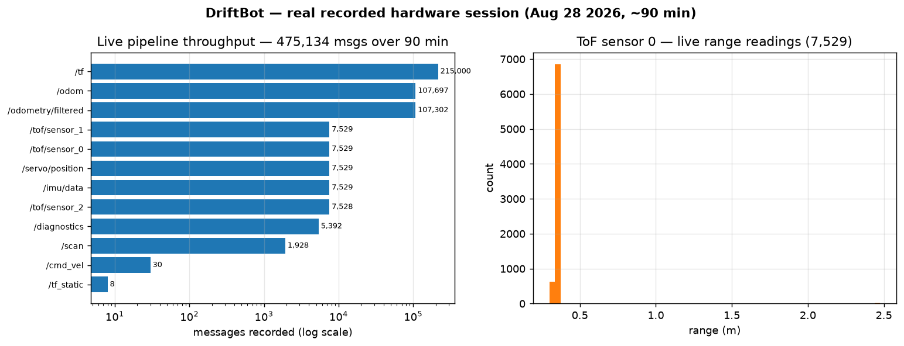

# DriftBot — Autonomous Ground Robot with 360° ToF SLAM (ROS2)

A from-scratch autonomous ground robot featuring a custom rotating ToF sensor array for 360° environment mapping. ESP32-S3 firmware communicates with a ROS2 Jazzy laptop over micro-ROS WiFi UDP, enabling real-time SLAM, sensor fusion, and autonomous navigation.

**Built to demonstrate:** full-stack robotics — embedded firmware, sensor fusion, state estimation, real-time control, and ROS2 integration on physical hardware.

## Demo & Recorded Evidence



*Generated directly from the recorded `.mcap` bag — real message counts, not a mock-up.*

A **90-minute live hardware session** (`.mcap`, ROS2 Jazzy) was recorded with the
full pipeline running on the physical robot. It captures **475,134 messages**
across the real topic set — the whole perception → estimation → SLAM chain
running end-to-end, not a simulation:

| Topic | Type | Messages | What it proves |
|-------|------|---------:|----------------|
| `/odometry/filtered` | `nav_msgs/Odometry` | 107,302 | `robot_localization` EKF fusion ran live |
| `/odom` | `nav_msgs/Odometry` | 107,697 | Base odometry stream |
| `/tf` | `tf2_msgs/TFMessage` | 215,000 | Full transform tree maintained |
| `/scan` | `sensor_msgs/LaserScan` | 1,928 | 360° ToF scans assembled from raw Range data |
| `/imu/data` | `sensor_msgs/Imu` | 7,529 | IMU streaming (bias-corrected) |
| `/tof/sensor_{0,1,2}` | `sensor_msgs/Range` | 7,529 each | 3× VL53L1X ToF sensors |
| `/servo/position` | `std_msgs/Float32` | 7,529 | Scanning-servo sweep telemetry |
| `/cmd_vel` | `geometry_msgs/Twist` | 30 | Teleop drive commands |

Session duration: **~89.9 min** (Aug 28 2026, 18:49→20:19). Bag: `bags/driftbot_ground_20260828_184909/`.

> **Still pending:** a trimmed 60–90 s screen-capture video (robot moving + RViz
> map building) and a saved occupancy-grid `.pgm/.yaml`. The recorded bag above
> already contains the data to regenerate both offline via `ros2 bag play`.

Reproduce the live setup: `./scripts/start_session.sh` (see Quick Start).

## System Architecture

```
┌─────────────────────────────────────────────────────────────────────────────────┐
│                           ESP32-S3 (Dual-Core Firmware)                           │
│                                                                                  │
│   Core 0 — Real-Time Control               Core 1 — Sensors + WiFi + ROS         │
│   ┌──────────────────────────┐             ┌──────────────────────────────────┐  │
│   │ Steering servo (MCPWM)   │             │ 3× VL53L1X ToF        (I2C 0)    │  │
│   │ DC motor + H-bridge      │  ← data →  │ MPU6050 IMU           (I2C 1)    │  │
│   │ Serial command handler   │             │ Scanning servo        (MCPWM 0)  │  │
│   │                          │             │ micro-ROS WiFi UDP publishers    │  │
│   └──────────────────────────┘             └──────────────────────────────────┘  │
│                                                        │                          │
└────────────────────────────────────────────────────────┼──────────────────────────┘
                                                         │ WiFi UDP :8888
                                                         ▼
┌─────────────────────────────────────────────────────────────────────────────────┐
│                          Laptop (ROS2 Jazzy)                                     │
│                                                                                  │
│   micro-ROS Agent ──→ scan_assembler ──→ slam_toolbox ──→ /map                  │
│                    ──→ robot_localization (EKF, optional)                        │
│                    ──→ teleop / rviz / rosbag2 (.mcap)                           │
└─────────────────────────────────────────────────────────────────────────────────┘
```

## Key Technical Features

### Perception — 360° Rotating ToF Scanner
- **3× VL53L1X** Time-of-Flight sensors mounted on a rotating triangular plate
- Servo sweeps ±60° sinusoidally; calibrated mount angles give full 360° coverage
- Custom `scan_assembler` node converts Range messages → `sensor_msgs/LaserScan`
- Scans are recorded live to `.mcap` bags for replay and analysis

### State Estimation
- **IMU** (MPU6050) on a dedicated I2C bus with rotation-matrix correction
- **SLAM Toolbox** localizes using the sparse ToF scan
- Wheel encoders are present but currently **disabled** due to wiring reliability; `odometry_node` can fall back to static identity odometry when encoders are off
- Optional **EKF fusion** via `robot_localization`

### Embedded — Dual-Core Real-Time Architecture
- **Core 0:** Motor control + steering + serial CLI — isolated from WiFi/I2C latency
- **Core 1:** Sensor I/O, scanning servo, and micro-ROS publishing
- **Two separate I2C buses:** `Wire` for ToF sensors, `Wire1` for the IMU (eliminates bus starvation)
- MCPWM timers re-initialized after WiFi startup to recover from radio-induced timer corruption
- XSHUT-based I2C address assignment for three identical VL53L1X sensors

### Communication — micro-ROS over WiFi
- 7 ROS2 topics published at 10Hz over UDP
- Standard message types (`Range`, `Imu`, `LaserScan`)
- One-command laptop startup via `bringup.launch.py`

## Hardware

| Component | Specification | Purpose |
|-----------|---------------|---------|
| ESP32-S3-DevKitC-1 | Dual-core 240MHz, WiFi | Main MCU |
| 3× VL53L1X (TOF-400C) | 4m range, 940nm laser, I2C | Distance sensing |
| MPU6050 | 6-axis (accel + gyro), I2C | Orientation & motion |
| 2× A3144 Hall Sensor | Unipolar, South-pole detect | Wheel odometry (disabled) |
| 2× MG90S Servo | 180°, 50Hz PWM | Sensor sweep + steering |
| BTS7960 H-bridge | 43A, dual PWM | DC motor control |
| Ackermann chassis | 64mm wheels, 235mm wheelbase | Mobility |

### Wiring Summary

```
I2C bus 0 (Wire)   — GPIO 8 (SDA), GPIO 9  (SCL)  → 3× VL53L1X ToF
I2C bus 1 (Wire1)  — GPIO 7 (SDA), GPIO 17 (SCL)  → MPU6050 IMU
GPIO 4, 5, 6       — XSHUT → ToF sensor enable (address assignment)
GPIO 18            — PWM → Scanning servo (sensor platform)
GPIO 10            — PWM → Steering servo
GPIO 11 / GPIO 12  — PWM → Motor H-bridge (forward / reverse)
GPIO 15 / GPIO 16  — Enable → Motor H-bridge
GPIO 13 / GPIO 14  — Interrupt → Hall encoders (currently disabled)
```

## Repository Structure

```
├── firmware/                    ESP32-S3 PlatformIO project
│   ├── src/main.cpp             Dual-core entry point (FreeRTOS)
│   ├── config/
│   │   ├── pins.h               Central GPIO pin map
│   │   ├── servo_config.h       Motion parameters
│   │   ├── tof_config.h         Sensor timing & geometry
│   │   ├── motor_config.h       Motor + steering limits
│   │   ├── calibration_data.txt Calibrated hardware constants
│   │   └── secrets.h            WiFi credentials (gitignored)
│   ├── components/
│   │   ├── servo/               Sinusoidal sweep driver
│   │   ├── tof/                 VL53L1X multi-sensor driver
│   │   ├── imu/                 MPU6050 with rotation matrix
│   │   ├── encoder/             A3144 hall encoder with debounce (disabled)
│   │   ├── motor/               DC motor + steering servo driver
│   │   └── ros_bridge/          micro-ROS publisher abstraction
│   ├── tests/                   Pin-diagnostics & hardware utilities
│   ├── test/                    PlatformIO Unity test suite
│   └── calibration/             Standalone calibration firmware
│
├── ros2_ws/src/driftbot_bringup/   Laptop-side ROS2 package
│   ├── driftbot_bringup/
│   │   ├── scan_assembler.py    ToF + servo → LaserScan (360°)
│   │   ├── odometry_node.py     Ackermann rear-encoder odometry → Odometry
│   │   └── topic_monitor.py     Live topic rate/value monitor
│   ├── launch/
│   │   ├── slam.launch.py       SLAM-only launch
│   │   └── bringup.launch.py    One-command full laptop stack
│   ├── config/
│   │   ├── robot_params.yaml    Physical dimensions & sensor geometry
│   │   ├── slam_toolbox.yaml    SLAM algorithm parameters
│   │   ├── ekf.yaml             EKF fusion parameters
│   │   └── bringup.yaml         Session-level bringup parameters
│   └── scripts/
│       └── start_session.sh     Tmux session orchestrator
│
├── scripts/
│   └── start_session.sh         Fresh tmux test session
├── docs/
│   ├── plan.md                  Interview-ready fix plan
│   └── maps/                    Generated occupancy-grid maps
├── MEMORY.md                    Project facts / calibration decisions
└── STATE.md                     Active work log
```

## ROS2 Topics

| Topic | Type | Rate | Source |
|-------|------|------|--------|
| `/servo/position` | `std_msgs/Float32` | 10Hz | ESP32 |
| `/tof/sensor_0` | `sensor_msgs/Range` | 10Hz | ESP32 |
| `/tof/sensor_1` | `sensor_msgs/Range` | 10Hz | ESP32 |
| `/tof/sensor_2` | `sensor_msgs/Range` | 10Hz | ESP32 |
| `/imu/data` | `sensor_msgs/Imu` | 50Hz | ESP32 |
| `/encoder/left` | `std_msgs/Int32` | 50Hz | ESP32 |
| `/encoder/right` | `std_msgs/Int32` | 50Hz | ESP32 |
| `/scan` | `sensor_msgs/LaserScan` | ~0.5Hz | Laptop |
| `/odom` | `nav_msgs/Odometry` | 20Hz | Laptop |
| `/map` | `nav_msgs/OccupancyGrid` | 0.5Hz | slam_toolbox |

## Quick Start

### 1. Flash the robot

```bash
# Configure WiFi credentials
cp firmware/config/secrets.h.template firmware/config/secrets.h
# Edit secrets.h with your WiFi SSID, password, and laptop IP

cd firmware && pio run --target upload
```

### 2. Build the laptop-side workspace

```bash
cd ros2_ws && colcon build --symlink-install
source install/setup.bash
```

> If you also built the micro-ROS agent from source, source that workspace first:
> `source microros_ws/install/setup.bash`

### 3. Start a fresh test session

```bash
./scripts/start_session.sh
```

> Run this from a normal terminal, **not** from inside another tmux session. If you are already in tmux, detach first or run `unset TMUX` before the script.

This creates a tmux session with four windows:

| Window | Purpose |
|---|---|
| `bringup` | micro-ROS agent + SLAM + `.mcap` recorder |
| `teleop`  | `teleop_twist_keyboard` — drive the robot with `i/k/j/l/,` |
| `monitor` | Live topic rate/value monitor |
| `manual`  | Spare shell for `ros2 topic …` commands |

Stop everything cleanly:

```bash
./scripts/stop_session.sh
```

Attach later with: `tmux attach -t driftbot`

### 4. Operate the robot

Attach to the session:

```bash
tmux attach -t driftbot
```

Switch windows with `Ctrl-b` + window number:

| Window | What to do |
|---|---|
| `1:bringup` | Leave running — agent, SLAM, bag recorder |
| `2:teleop`  | Drive with keyboard (US layout). `i`=forward, `k`=stop, `,`=reverse, `j`=left, `l`=right. `q/z`=speed. `Ctrl-c`=quit. |
| `3:monitor` | Watch live topic rates and last values |
| `4:manual`  | Run ad-hoc commands, e.g. `ros2 topic echo /map` |

To see the map live, start the session with RViz:

```bash
./scripts/start_session.sh --rviz
```

Or open RViz manually from the `manual` window:

```bash
rviz2 -d $(ros2 pkg prefix driftbot_bringup)/share/driftbot_bringup/config/driftbot.rviz
```

### 5. Save a map

After driving around:

```bash
ros2 run nav2_map_server map_saver_cli -f docs/maps/corridor_map
```

### 6. Stop everything

```bash
./scripts/stop_session.sh
```

## Results

| Metric | Value | Method |
|--------|-------|--------|
| micro-ROS transport | WiFi UDP :8888 | micro-ROS agent |
| Servo scan rate | ~8–9 Hz / 360° sweep | `/servo/position` topic |
| IMU publish rate | ~9 Hz | `/imu/data` topic |
| Gyro drift (raw) | 29.6°/min | Static IMU test |
| Gyro drift (corrected) | <1°/min | After bias subtraction |
| ToF timing budget | 20 ms | `tof_config.h` |
| Motor safety timeout | 1000 ms | Watchdog auto-stop |
| SLAM map resolution | 5 cm/cell | `slam_toolbox.yaml` |
| Wall material (test track) | Cardboard | Physical test setup |

## Technical Decisions

| Decision | Rationale |
|----------|-----------|
| Dual-core split | Core 0 handles real-time motor/steering; Core 1 handles sensors, WiFi, and ROS publishing |
| Two I2C buses | IMU was unreliable on the loaded ToF bus; a dedicated `Wire1` bus eliminated stalls |
| Sinusoidal scanning servo | Natural deceleration at endpoints — no mechanical shock, smooth reversal |
| MCPWM re-init after WiFi | Radio startup can corrupt MCPWM timers; re-initializing restores PWM outputs |
| XSHUT address assignment | Allows three identical VL53L1X sensors on the same bus |
| Encoders disabled | Wiring reliability issue on one encoder; code falls back to scan-matching localization |
| WiFi UDP (not Serial) | Decouples robot from tether; enables fully untethered tests |
| Rotation matrix in firmware | Offloads sensor-frame correction to MCU; laptop receives REP-103-standard data |

## Skills Demonstrated

- **Embedded C++** — PlatformIO, FreeRTOS tasks, hardware interrupts, I2C drivers
- **ROS2** — micro-ROS, custom nodes, TF tree, launch files, parameter management
- **Sensor Fusion** — wheel odometry + IMU + EKF (robot_localization)
- **SLAM** — scan assembly from sparse ToF data, slam_toolbox integration
- **Real-Time Systems** — dual-core scheduling, interrupt-safe shared data
- **Hardware-Software Co-Design** — pull-up sizing, decoupling caps, debounce tuning
- **Signal Integrity** — I2C bus noise mitigation (capacitors, timeouts, retries)
- **Kinematics** — Ackermann steering model, sinusoidal motion planning, coordinate transforms

## Dependencies

**Firmware:** PlatformIO, ESP32Servo, Pololu VL53L1X, micro-ROS

**Laptop:** ROS2 Jazzy, slam_toolbox, robot_localization, tf2_ros

## License

MIT
